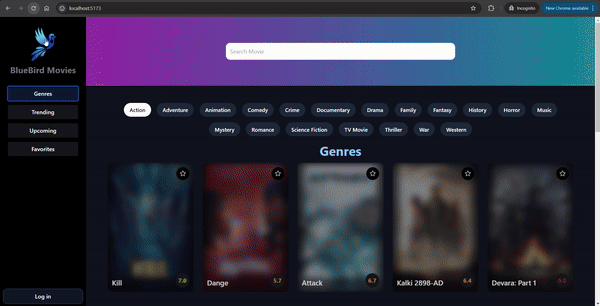

# Machine-Learning---Movie-Recommendation-System---Association
A movie recommender system using association rules mining.


## note : 
The notebook including the eda , data preprocessing and model traning is in the file notebook.ipynb

# Getting Started:
## Installation
``` conda ``` command should be executed in anaconda powershell or prompt.
```bash
conda create --name ML_Mini_Project python==3.11.4
conda activate ML_Mini_Project
pip install -r requirements.txt
```
Must run this command after each new packages are installed.
```
pip freeze > requirements.txt
```
### Frontend

#### Step 1: Install dependencies
```
cd '.\Front Movies web\'
npm install
npm run dev
```
#### Step 2: Obtain the TMDB Movies API Key

Before starting the website, you will need to obtain the TMDB Movies API key. Follow these steps to obtain them and add them to your `.env` file.

### Get TMDB API Key 

- Go to https://www.themoviedb.org/ and log in.
- Click on your user profile picture in the navigation bar, and select "Settings".
- In the settings, select "API" and generate an API key.
